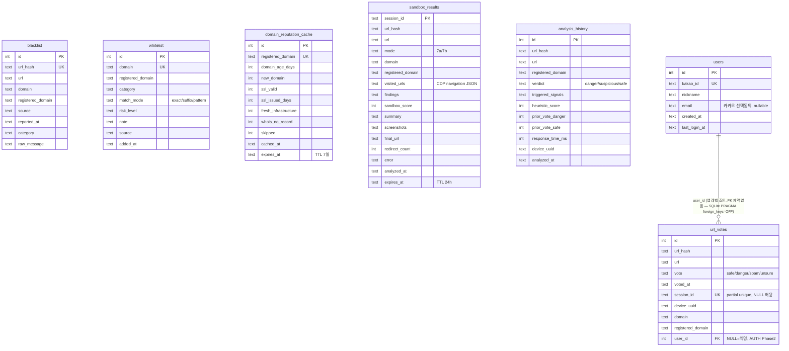

# ERD — `backend/security_hub.db` (2026-07-01 기준 실제 스키마)

> 이전 `ERD.png`(2026-05-28 작성)는 `users` 테이블 전체 누락, `url_votes.user_id` 누락,
> `sandbox_results`의 컬럼명 3개 불일치(`screenshot_paths`→실제 `screenshots`,
> `findings_json`→실제 `findings`, `created_at`/`expired_at`→실제 `analyzed_at`/`expires_at`)가
> 확인되어 `docs/legacy/ERD.png`로 이동하고 이 문서로 대체했다.
> 출처는 [`backend/database/db_init.py`](../backend/database/db_init.py) 실제 `CREATE TABLE` 문.

## 다이어그램

박스 배치와 선 굵기·직각 라우팅은 참고용 레퍼런스 ERD(교통카드 스키마) 스타일을
따랐다 — 표 하나당 상단에 PK를 굵게+밑줄로 구분선 위에 두고, 나머지 속성은
좌측 이름/우측 타입 2열로 배치.

- **실제 FK**(`users.id → url_votes.user_id`)는 실선 + 까마귀발 표기로 연결.
- **`sandbox_results` ↔ `url_votes` ↔ `analysis_history`** 셋은 DB 레벨 FK는
  아니지만(`registered_domain` 기준 앱 코드 조인) 이 프로젝트의 핵심인 "피드백
  순환"을 그대로 나타내므로, 번호 매긴 점선 화살표 3개로 표시했다: ① 7-A 세션
  종료 → 투표, ② `sandbox_danger_score` 시그널 반영, ③ `prior_*_vote_*` 시그널로
  다음 분석에 반영. (2026-07-02, 사용자 피드백으로 추가 — 원래는 각주로만
  남겨뒀었는데 이 셋은 단순 참조 조인이 아니라 서사의 핵심이라 판단)
- 그 외 `blacklist`/`whitelist`/`domain_reputation_cache`와의 `registered_domain`/
  `url_hash` 공유 키 조인은 다 그리면 선이 얽혀 오히려 안 보이므로 아래 표로 대체했다.

`docs/ERD.svg`는 스키마가 바뀔 때 좌표를 손으로 다시 맞춰야 하는 정적 이미지라,
빠르게 텍스트로 스키마만 확인하고 싶을 때는 아래 Mermaid 소스(GitHub 자동 렌더링,
diff 추적 가능)를 참고할 것.

Mermaid 소스 (텍스트 기반, 스키마 diff용)

## 참고 — DB 레벨 FK가 아닌 암묵적 조인 키

SQLite는 `PRAGMA foreign_keys` 기본 OFF로 운영되며(탈퇴 흐름이 졸업작품 범위 밖이라 ON으로
바꿀 이유가 없음, `backend/database/db_init.py` 주석 참조), 위 다이어그램에 그린
`users ||--o{ url_votes` 하나를 제외하면 실제 FK 제약은 없다. 대신 아래 컬럼들이
애플리케이션 코드에서 관례적으로 조인 키 역할을 한다:

| 공유 키 | 사용 테이블 |
|---|---|
| `url_hash` | `blacklist`, `url_votes`, `sandbox_results`, `analysis_history` |
| `registered_domain` | `blacklist`, `whitelist`, `domain_reputation_cache`, `url_votes`, `sandbox_results`, `analysis_history` |

`heuristic_scorer.py`의 `prior_danger_vote_*` / `prior_safe_vote_*` / `prior_spam_vote_*` 시그널이
`url_votes`를 `registered_domain` 기준으로 집계해 매 분석에 반영하는 것이 이 조인 관계의
핵심 용도다 (피드백 순환 구조, `CLAUDE.md` 참조).

## 인덱스 요약

| 테이블 | 인덱스 | 비고 |
|---|---|---|
| `blacklist` | `idx_blacklist_domain`, `idx_blacklist_registered_domain` | |
| `whitelist` | `idx_whitelist_domain`, `idx_whitelist_registered_domain` | |
| `domain_reputation_cache` | `idx_rep_cache_domain`, `idx_rep_cache_expires` | |
| `url_votes` | `idx_votes_url_hash`, `idx_votes_session_id`(partial, session_id NOT NULL), `idx_votes_device_domain`(partial unique — 어그로 방어 Layer 1) | |
| `sandbox_results` | `idx_sandbox_url_hash`, `idx_sandbox_expires` | |
| `analysis_history` | `idx_history_url_hash` | |
| `users` | `kakao_id` UNIQUE 자동 인덱스 | 별도 인덱스 없음 (쓰기 비용 절감) |
