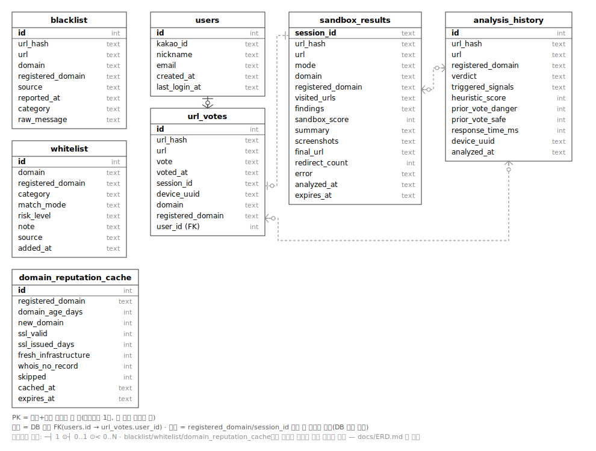
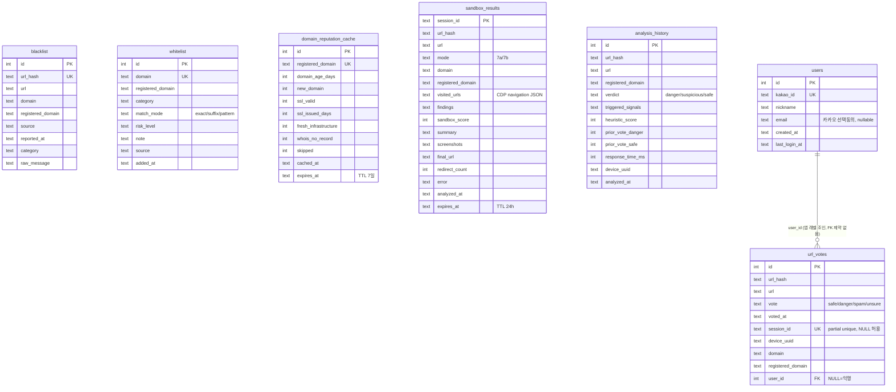

# ERD — `backend/security_hub.db`

## 다이어그램

실제 FK는 `users.id → url_votes.user_id` 하나뿐입니다. `sandbox_results` / `url_votes` / `analysis_history` 사이는 DB 레벨 FK는 아니지만 `registered_domain` 기준으로 앱 코드에서 조인되는 관계라, 점선 화살표 3개로 표시했습니다: ① 7-A 세션 종료 후 투표, ② `sandbox_danger_score` 시그널 반영, ③ `prior_*_vote_*` 시그널로 다음 분석에 반영 — 이 프로젝트의 핵심인 "피드백 순환" 구조입니다.

그 외 `blacklist`/`whitelist`/`domain_reputation_cache`와의 `registered_domain`/`url_hash` 공유 키 조인은 다 그리면 선이 얽혀서 아래 표로 대신 정리했습니다.

Mermaid 소스 (텍스트 기반, 스키마 diff 확인용)

## 참고 — DB 레벨 FK가 아닌 암묵적 조인 키

SQLite는 `PRAGMA foreign_keys`가 기본 OFF라서, 위 다이어그램의 `users ||--o{ url_votes` 하나를 빼면 실제 FK 제약은 없습니다. 대신 아래 컬럼들이 애플리케이션 코드에서 조인 키 역할을 합니다.

| 공유 키 | 사용 테이블 |
|---|---|
| `url_hash` | `blacklist`, `url_votes`, `sandbox_results`, `analysis_history` |
| `registered_domain` | `blacklist`, `whitelist`, `domain_reputation_cache`, `url_votes`, `sandbox_results`, `analysis_history` |

`heuristic_scorer.py`의 `prior_danger_vote_*` / `prior_safe_vote_*` / `prior_spam_vote_*` 시그널이 `url_votes`를 `registered_domain` 기준으로 집계해서 매 분석에 반영하는 것이 이 조인 관계의 핵심 용도입니다.

## 인덱스 요약

| 테이블 | 인덱스 |
|---|---|
| `blacklist` | `idx_blacklist_domain`, `idx_blacklist_registered_domain` |
| `whitelist` | `idx_whitelist_domain`, `idx_whitelist_registered_domain` |
| `domain_reputation_cache` | `idx_rep_cache_domain`, `idx_rep_cache_expires` |
| `url_votes` | `idx_votes_url_hash`, `idx_votes_session_id`(partial), `idx_votes_device_domain`(partial unique — 1기기 1표 방어) |
| `sandbox_results` | `idx_sandbox_url_hash`, `idx_sandbox_expires` |
| `analysis_history` | `idx_history_url_hash` |
| `users` | `kakao_id` UNIQUE 자동 인덱스 |
