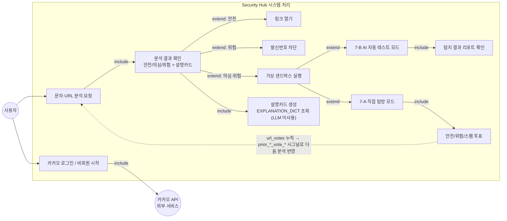
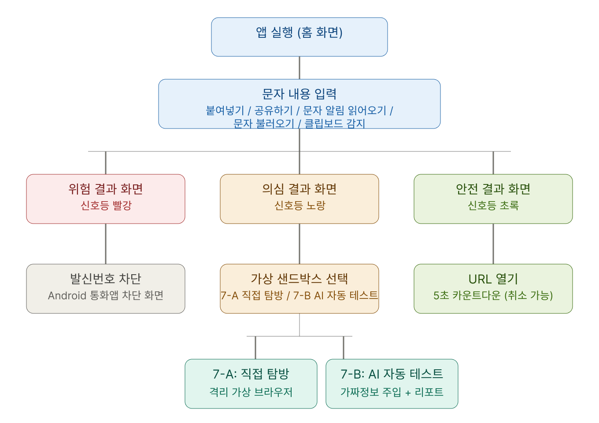
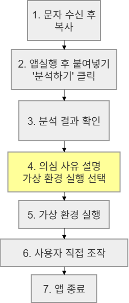
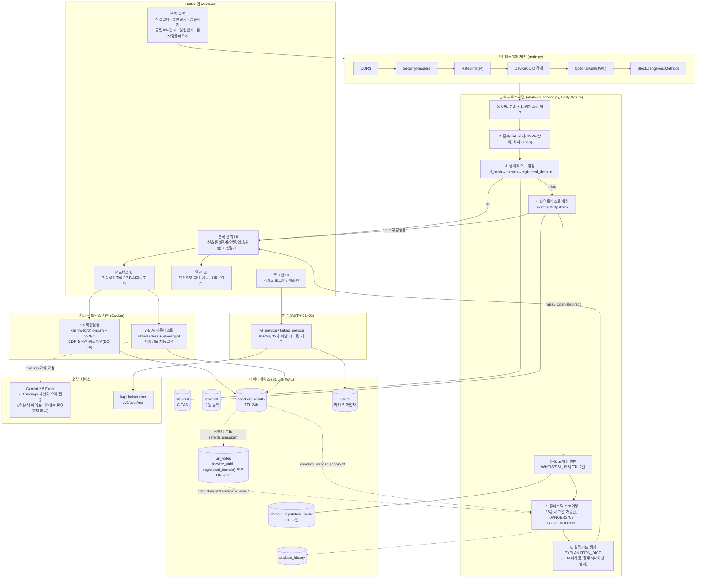

# Security Hub — 최종 보고서 초안

> 한이음 ICT 드림업 2026 졸업작품. 지도교수 지정 목차 + 코멘트(페르소나·벤치마킹
> 추가, 시각자료 설명 필수, ERD는 4장, 8장은 팀원별 작성) 반영.
> **🔲 [팀 입력 필요]** 표시가 붙은 항목은 기존 문서로 근거를 만들 수 없어서
> 자리만 잡아뒀다 — 팀이 직접 채워야 한다. 나머지는 `docs/` 기존 자료를
> 근거로 바로 초안을 썼고, 출처를 각주로 남겼다.
> 나중에 한글/워드로 옮길 때 이미지는 `docs/*.svg`, `docs/*.png`를 그대로
> 삽입하면 된다.

---

## 1. 프로젝트 개요

### 1.1 프로젝트 주제

**AI 기반 피싱(스미싱) 탐지 및 가상 환경 테스트 앱**

의심스러운 문자·URL을 다신호 스코어링 파이프라인으로 분석해 **안전 / 의심 /
위험** 3단계로 판정하고, 판정이 애매한 경우 격리된 가상 샌드박스(직접 탐방 또는
AI 자동 테스트)에서 사용자가 안전하게 확인해볼 수 있게 하는 Flutter(Android) +
FastAPI 앱이다.

### 1.2 프로젝트 선정 이유

🔲 **[팀 입력 필요]** — 아래 질문에 답하는 방식으로 작성 권장:

- 왜 "스미싱 탐지"라는 주제를 골랐는가? (개인적 피해 경험, 사회적 이슈, 기존
  서비스의 불편함 등)
- 왜 단순 차단이 아니라 "샌드박스 + 투표 피드백" 구조를 선택했는가? — 참고로
  이 설계 철학 자체는 이미 `CLAUDE.md` 최상단에 "사용자 즉각 피드백 기반
  학습형 위협 인텔리전스 시스템"으로 정리돼 있으니, 그 결론에 이르게 된
  **과정**(왜 정적 블랙리스트만으론 부족하다고 판단했는지)을 팀 목소리로
  풀어 쓰면 된다.

### 1.3 개발 환경

| 구분 | 내용 |
|---|---|
| 사용 언어 | Python 3.11+ (백엔드), Dart (Flutter, 프론트엔드) |
| 백엔드 프레임워크 | FastAPI 0.135, Uvicorn |
| 프론트엔드 프레임워크 | Flutter (Android only, `minSdkVersion=21`) |
| DB | SQLite (WAL 모드, `backend/security_hub.db`) |
| 개발 도구 | VSCode / Android Studio, Git + GitHub |
| 컨테이너 | Docker Desktop (`kasmweb/chromium:1.14.0`, `ghcr.io/browserless/chromium`) |
| 실행 방식 | 백엔드: `uvicorn main:app --reload` 로컬 서버 / 프론트: APK 직배포(스토어 미배포) — 에뮬레이터에서는 `10.0.2.2` 또는 `adb reverse`로 로컬 백엔드 연결 |
| 외부 API | Gemini 2.5 Flash (7-B 샌드박스 요약 전용), 카카오 로그인 API |

출처: `README.md`, `CLAUDE.md` 실행 명령어 섹션.

---

## 2. 서비스 개요

### 2.1 서비스 설명

**핵심 기능**

1. 문자/URL 스미싱 판정 — 블랙리스트 → 화이트리스트 → 도메인 평판 → 휴리스틱
   25종 시그널 가중합을 거쳐 안전/의심/위험 3단계 판정 + 판정 근거를 설명
   카드로 제공
2. 가상 샌드박스 — 판정이 "의심"으로 애매할 때, 실제 기기가 아닌 격리된
   서버 컨테이너 안에서 사이트를 직접 눌러보거나(7-A), AI가 가짜 개인정보를
   자동 입력해 위험 행동을 탐지(7-B)
3. 투표 피드백 순환 — 샌드박스에서 확인한 사용자가 안전/위험 투표를 하면
   `url_votes`에 누적되고, 다음 분석부터 그 결과가 휴리스틱 점수에 자동
   반영됨 — 정부 블랙리스트(C-TAS)가 아직 못 잡은 신규 위협을 사용자 집단이
   먼저 발견하는 구조

**주요 사용자와 사용 상황**: 출처가 불분명한 문자(택배 사칭, 정부 지원금
사칭, 청첩장 사칭 등)를 받았을 때 링크를 누르기 전에 안전 여부를 확인하고
싶은 스마트폰 사용자. 특히 문자 내 링크의 진위를 스스로 판단하기 어려운
사용자(고령층, 스미싱 수법에 익숙하지 않은 사용자)를 주 타깃으로 상정.

출처: `presentation_script.md` 1장, `CLAUDE.md` 정체성 문단.

### 2.2 사용자 정의 (페르소나)

🔲 **[팀 입력 필요]** — 아래 표를 채우는 방식 권장(2~3명 정도).

| 항목 | 페르소나 A (예시 틀) | 페르소나 B (예시 틀) |
|---|---|---|
| 이름/나이/직업 | | |
| 스마트폰 활용 수준 | | |
| 스미싱 관련 경험 | | |
| 겪는 불편 (Pain Point) | | |
| 이 앱을 쓰는 상황 | | |
| 이 앱으로 해결되는 것 | | |

> 힌트: 2.1의 "주요 사용자" 서술과 일치해야 함 — 특히 "링크 진위 판단이
> 어려운 사용자"를 구체적인 한 명으로 구체화하면 됨.

### 2.3 유사 서비스 벤치마킹

🔲 **[팀 입력 필요]** — 아래는 조사 시작점으로 후보만 나열한 것이고, 실제
기능 비교는 각 서비스를 직접 써보고 채워야 한다(추측으로 채우지 말 것).

| 서비스 | 제공 주체 | 비교 포인트(직접 확인 필요) |
|---|---|---|
| 후후(whowho) / T전화 스팸 알림 | 민간(SKT 등) | 발신번호 기반 vs 본 프로젝트의 URL 콘텐츠 기반 |
| 시티즌 코난 | 경찰청 | 악성 앱 실시간 탐지 방식 |
| KISA 보호나라 / 스팸SafeR | 정부(KISA) | 본 프로젝트가 쓰는 C-TAS 블랙리스트의 원 출처 |
| 삼성 스마트콜 / 통신3사 스팸 필터 | 제조사/통신사 | OS/통신사 레벨 필터링과의 차이 |

**차별점으로 이미 정리돼 있는 내용** (`CLAUDE.md`, `presentation_script.md`
참조 — 벤치마킹 표를 채운 뒤 "그래서 우리가 다른 점" 결론에 활용):

- 대부분의 기존 서비스는 정적 블랙리스트/발신번호 필터링에 그침
- 본 프로젝트는 여기에 **가상 샌드박스 체험** + **사용자 투표 피드백 순환**을
  더해 신규 위협에 대한 자체 학습 능력을 갖춤

### 2.4 주요 기능

#### Usecase Diagram



> **그림 설명**: 사용자는 로그인 여부와 무관하게 문자/URL 분석을 요청할 수
> 있고, 판정 결과에 따라 링크 열기·발신번호 차단·샌드박스 실행 중 하나로
> 분기한다. 샌드박스 안에서 발생한 투표(UC9)가 점선 화살표로 표시된 것처럼
> 다시 분석 파이프라인(UC1)에 피드백되는 것이 이 시스템의 핵심 구조다.
> (출처: `docs/use_case_diagram.md`)

#### 기능별 설명

| 기능 | 설명 |
|---|---|
| 문자 입력 5경로 | 직접 입력, 공유하기(`Intent.ACTION_SEND`), 클립보드 자동 감지, 문자함 불러오기, SMS 수신 알림(`BroadcastReceiver`) — 전부 동일 분석 파이프라인으로 수렴 |
| 분석 판정 | 8단계 파이프라인(블랙리스트→화이트리스트→도메인평판→휴리스틱 25종)을 거쳐 안전/의심/위험 판정, 근거를 설명카드로 제시 |
| 7-A 직접 탐방 | `kasmweb/chromium` 컨테이너 + noVNC로 격리된 브라우저를 실제 손가락 조작처럼 사용, CDP로 실시간 위협(피싱 이동·악성 다운로드) 자동 차단 |
| 7-B AI 자동 테스트 | Browserless + Playwright가 가짜 이름·전화번호·카드번호를 자동 입력해 개인정보 탈취 폼 여부 등을 기계적으로 검사, Gemini가 결과를 자연어 요약 |
| 투표 | 샌드박스 체험 후 안전/위험/스팸 투표 → `url_votes` 누적 → 다음 분석의 휴리스틱 점수에 반영(피드백 순환) |
| 카카오 로그인 | 비회원(익명 device_uuid)도 전 기능 사용 가능하되, 카카오 로그인 시 투표 신뢰도 가중치 상승(어뷰징 방지, AUTH-01~03) |

출처: `docs/system_architecture.md`, `docs/guide/01_분석파이프라인.md`,
`docs/guide/02_샌드박스.md`, `docs/guide/03_투표인증.md`,
`docs/guide/05_프론트엔드.md`.

#### 사용자 유형 설명

| 유형 | 식별 | 차이 |
|---|---|---|
| 비회원(익명) | `X-Device-UUID` 헤더(기기별 영구 발급) | 전 기능 사용 가능. 투표는 기기당 도메인 1표로 제한(어그로 방어 Layer 1) |
| 카카오 가입회원 | JWT(`Authorization: Bearer`) | 휴대폰 본인인증을 거쳐 투표 신뢰도 임계값이 낮아짐(`user_X≥3`이 `anon_X≥10`과 동급 가중치, DC-45) |

### 2.5 메뉴구성도



> **그림 설명**: 홈 화면에서 문자를 입력하면(붙여넣기/공유하기/알림읽기 등
> 5가지 경로) 안전·의심·위험 3단계 결과 화면으로 분기한다. 위험 결과에서는
> 발신번호 차단으로, 의심 결과에서는 가상 샌드박스(7-A 직접탐방 / 7-B AI
> 자동테스트) 선택으로 이어진다. (2026-07-01 기존 코드와 대조 검토 완료,
> 현재 메뉴 구조와 일치)

### 2.6 User Flow (End2End 시나리오)



> **그림 설명**: 문자 수신 → 복사 → 앱에 붙여넣고 분석 → 결과 확인 → (의심
> 사유가 있을 때) 가상 환경 실행 선택 → 가상 환경에서 사용자 직접 조작 →
> 앱 종료까지 이어지는 7단계 대표 시나리오. 실제로는 위 메뉴구성도처럼
> 판정에 따라 분기하지만, 이 그림은 "의심 → 샌드박스 체험"이라는 이 앱의
> 가장 특징적인 경로 하나를 골라 보여준다.

---

## 3. 요구사항 정의

### 3.1 기능 요구사항

| 분류 | 요구사항 |
|---|---|
| 문자 입력 | 직접입력/공유하기/클립보드감지/문자함불러오기/SMS알림 5경로 지원 (INP-02~05) |
| URL 분석 | URL 추출, 단축 URL 해제(최대 3-hop, SSRF 방어), 위험 스킴(`javascript:`/`data:`/`vbscript:`/`file:`/`blob:`) 차단 |
| 블랙리스트 매칭 | KISA C-TAS 기반 url_hash→domain→registered_domain 3단계 매칭 |
| 화이트리스트 매칭 | exact/suffix/pattern 3가지 매칭 모드, Open Redirect 스푸핑 탐지 |
| 도메인 평판 분석 | WHOIS 등록일, SSL 발급일 조회(7일 캐시) |
| 휴리스틱 스코어링 | 25종 시그널 가중합, DANGER≥70/SUSPICIOUS≥30 |
| 설명카드 제공 | `EXPLANATION_DICT` 기반 판정 근거 카드 생성(LLM 미사용) |
| 가상 샌드박스(7-A) | 격리 컨테이너에서 직접 브라우징, CDP 기반 실시간 위협 자동 차단 |
| 가상 샌드박스(7-B) | AI 자동 폼 입력 테스트 + Gemini 자연어 요약 |
| 투표 | 안전/위험/스팸/모르겠음 4지선다, 기기당 도메인 1표 제한 |
| 인증 | 카카오 소셜 로그인(AUTH-01) + 본인 프로필 조회(AUTH-02) + 로그아웃(AUTH-03), `users` 테이블 관리(DAT-07), 비회원 익명 모드 병행 |
| 발신번호 차단 | Android 통화앱 차단 화면 연동 UI (⚠ 기능 미연결, 7.2 참조) |

> SRS v11에는 인증 관련 요구사항이 전혀 없었다(오히려 NF-30 설명에 "회원가입
> 미도입 사유"가 명시돼 있었음). `docs/legacy/security_hub_srs_v12.xlsx`로
> 갱신하면서 AUTH-01~03·DAT-07·NF-31(JWT 보안)·NF-32(외부 배포 노출)를
> 신규 요구사항으로 추가했다 — 실제 코드가 스펙보다 먼저 나간 케이스.

### 3.2 비기능 요구사항

| 분류 | 요구사항 | 목표치 | 실측 결과(§6 참조) |
|---|---|---|---|
| 응답 시간 | 화이트리스트 히트 | p95 ≤ 50ms | p95 22.7ms PASS |
| 응답 시간 | 휴리스틱 전용 | p95 ≤ 100ms | p95 18.3ms PASS |
| 응답 시간 | WHOIS+SSL 풀 조회 | p95 ≤ 3000ms | p95 1277.6ms PASS |
| 가용성 | `/analyze` 동시 요청 | 100명 전부 성공 | p95 711ms PASS (1000명은 단일 워커 dev 서버 한계로 다운) |
| 동시성 제한 | 샌드박스 세션 하드캡 | 7-A 4개 / 7-B 3개, 초과 시 즉시 503 | 슬롯 수만 정확히 성공 확인 PASS |
| 정확도 | C-TAS 위협탐지율 | ≥95% (SRS 목표) | 100.0% (200/200, 독립 holdout) PASS |
| 정확도 | Safe FPR | 최소화 | 0.0% (0/50) |
| 보안 | Rate Limit | `/analyze` 10/min 등 엔드포인트별 제한 | 11번째 요청 429 확인 PASS |
| 보안 | 컨테이너 격리 | 탈출시도 차단 | 6종 11/11 차단 PASS |
| 데이터 무결성 | SAFE 판정 | 화이트리스트 히트 경로만 허용 (DC-06) | 코드 레벨 강제, 0클램프 |
| 보안 | JWT 인증(NF-31) | 32자 미만 시크릿 거부, HS256, 만료 720h | 코드 레벨 강제(`jwt_service.py`) 확인 PASS |
| 보안 | 컨테이너 DNS 고정(NF-13) | 외부 공인 DNS(1.1.1.1) 고정 | **미구현** — `browse_service.py`에 `--dns` 옵션 자체가 없음 |
| 보안 | Rate Limit 식별 단위(NF-24) | device_uuid 기반(CGNAT 오탐 방지 목적) | **스펙과 다름** — 실제 구현은 IP 기반, `X-Forwarded-For` 무조건 신뢰(P1-4) |
| 탐지율 | 위험 스킴 차단율(NF-18) | 100% | **목표 미달** — 인코딩(`%61`)·공백 프리픽스로 Stage 1 우회 가능(P0-2) |

출처: `docs/qa_benchmark.md`, `docs/system_accuracy_eval.md`,
`docs/sandbox_hardening.md`, `docs/load_test.md`,
`docs/legacy/security_hub_srs_v12.xlsx`(NF-13/18/24/31 코드 대조 재검증).

---

## 4. 아키텍처 설계

### 4.1 시스템 구성도



> **그림 설명**: 위에서부터 Flutter 앱(UI) → 보안 미들웨어 체인 → 분석
> 파이프라인 → DB의 4단 구조다. 굵은 실선은 즉시 판정 반환 경로, 점선은
> 나중에 다시 반영되는 피드백 경로다. Gemini는 분석 파이프라인이 아니라
> 7-B 샌드박스 결과 요약에만 관여한다는 점이 이 구성도의 핵심 — 설명카드는
> LLM 호출 없이 사전 정의된 딕셔너리에서만 생성된다(할루시네이션 방지).
> (출처: `docs/system_architecture.md`, 2026-07-01 실제 코드 대조 후 재작성)

### 4.2 ERD


> **그림 설명**: SQLite 7개 테이블 구조. PK는 굵게+밑줄로 표시했다. 실제
> DB 레벨 FK 제약은 `users.id → url_votes.user_id` 하나뿐이며(SQLite
> `PRAGMA foreign_keys=OFF` 운영), 나머지 테이블(blacklist/whitelist/
> domain_reputation_cache/sandbox_results/analysis_history)은
> `registered_domain` 또는 `url_hash`를 공유 키로 애플리케이션 코드에서만
> 조인한다. 특히 `url_votes`가 `registered_domain` 기준으로 집계돼
> 휴리스틱 스코어링의 `prior_*_vote_*` 시그널로 재반영되는 것이 이 스키마의
> 핵심 — 투표(DB) → 분석(로직) 피드백 순환의 물리적 구현이다.
> (출처: `docs/ERD.md`, `backend/database/db_init.py`)

### 4.3 프로젝트 파일 구조

```
security_hub/
├── backend/
│   ├── main.py                  # FastAPI 진입점, 미들웨어 체인, lifespan
│   ├── config.py                # 전역 상수
│   ├── routers/                 # analyze.py, sandbox.py, auth.py
│   ├── schemas/                 # Pydantic 모델
│   ├── services/                # analysis_service, heuristic_scorer,
│   │                             # domain_similarity, url_validator,
│   │                             # url_expander, browse_service(7-A),
│   │                             # sandbox_service(7-B), gemini_service,
│   │                             # domain_reputation_service, kakao_service,
│   │                             # jwt_service
│   ├── database/                # db_init, blacklist_service,
│   │                             # whitelist_service, vote_service,
│   │                             # user_service, analysis_history_service
│   └── tests/                   # pytest 단위테스트 + 평가 스크립트
├── frontend/lib/
│   ├── main.dart
│   ├── models/analysis_result.dart
│   ├── services/                # api_service, platform_service
│   ├── widgets/                 # quick_chip, sms_picker_sheet
│   └── screens/                 # home_screen, sandbox_browse_screen,
│                                 # virtual_sandbox_screen, LoginScreen
├── data/
│   ├── raw/                     # C-TAS smishing CSV + whitelist_v2.csv
│   └── scripts/                 # load_ctas_csv, migrate_db 등
└── docs/                        # 본 보고서를 포함한 전체 문서
```

출처: `CLAUDE.md` 디렉토리 구조 섹션(전체 상세본).

---

## 5. 주요 기술

| 영역 | 기술 | 사용 목적 |
|---|---|---|
| 백엔드 프레임워크 | FastAPI 0.135 + Uvicorn | 비동기 REST API 서버 |
| DB | SQLite (WAL 모드, RO/RW 커넥션 분리) | 경량 배포, 읽기 성능과 쓰기 안전성 동시 확보 |
| 컨테이너 격리 | Docker SDK for Python + `kasmweb/chromium` + `ghcr.io/browserless/chromium` | 7-A/7-B 가상 샌드박스, `cap_drop=ALL` + `no-new-privileges` + 리소스 제한(mem/cpu/pids)으로 탈출 방어 |
| 브라우저 자동화 | Playwright | 7-B AI 자동 테스트의 폼 입력·네비게이션 제어 |
| 실시간 위협 감시 | Chrome DevTools Protocol (CDP) | 7-A 세션 중 `Page.frameNavigated`/`Page.downloadWillBegin` 감지, 매 navigation마다 블랙리스트 재매칭 |
| 도메인 정보 조회 | `python-whois`, `tldextract` | WHOIS 등록일, 등록 도메인(eTLD+1) 추출 |
| 문자열 유사도 | Levenshtein 거리 | 타이포스쿼팅(`naverr.com` 등) 탐지 |
| 인증 | 카카오 로그인 API + `pyjwt`(HS256) | 소셜 로그인, 무상태(stateless) JWT 발급/검증 |
| LLM | Google Gemini 2.5 Flash (`google-genai`) | 7-B 샌드박스 findings 자연어 요약 **전용** — 분석 판정에는 관여하지 않음 |
| 프론트엔드 | Flutter (Dart), Android only | `flutter_inappwebview`(noVNC WebView), `permission_handler`, `kakao_flutter_sdk_user`, `shared_preferences` |
| 네트워크 노출(선택) | Cloudflare Tunnel | 로컬 서버를 외부(심사자 등)에 HTTPS로 노출 |

핵심 알고리즘 — **휴리스틱 스코어링**: 25종 시그널(IP 직접 접속, 위험 확장자,
userinfo injection, 타이포스쿼팅, 동형문자, 서브도메인 스푸핑, 신규 도메인,
투표 이력 등)에 가중치를 매겨 합산하고, DANGER 임계값(70점)은 단일 시그널
최댓값(40점)보다 높게 설계해 항상 2개 이상의 근거가 결합돼야 위험 판정이
나오도록 강제한다.

출처: `backend/requirements.txt`, `frontend/pubspec.yaml`,
`docs/guide/08_부록.md`.

---

## 6. 테스트 결과

### 6.1 테스트 계획

성능 평가를 5단 구조로 분리해서 측정했다 — 시스템 전체 정확도와 휴리스틱
컴포넌트 내부 동작을 섞어서 두 번 잘못된 결론을 낸 뒤 정정한 방법론이다.

| 단계 | 측정 대상 | 스크립트 |
|---|---|---|
| (a) 시스템 레벨 3분류 정확도 | `AnalysisService.analyze()` 전체 파이프라인 실제 호출 | `run_performance_eval.py`, `run_holdout_eval.py` |
| (b) 휴리스틱 컴포넌트 단위 | `score_url()` 단독 호출(블랙/화이트 우회) | `run_heuristic_eval.py`, `test_heuristic_scorer.py` |
| (c) 투표→위험 승급 실증 | DB에 실제 투표 적재 후 재분석 | `run_vote_escalation_test.py` |
| (d) 투표→안전 톤완화 실증 | 동일 | `run_safe_tone_down_test.py` |
| (e) 7-B 샌드박스 실데이터 | 실제 Docker+Playwright 라이브 방문 | `run_sandbox_eval.py` |
| NF(비기능) | 응답시간·동시성·레이트리밋 | `qa_benchmark.md`용 경량 스크립트 |
| 보안(컨테이너 탈출) | 6종 탈출 시도 직접 실행 | `run_sandbox_escape_test.py` |

**테스트 조건**: (a)(b)는 서버 기동 없이 함수 직접 호출, (e)/NF/보안은 실제
Docker 컨테이너·uvicorn 서버 기동 후 측정. NF 측정 시 `/analyze` 자체
레이트리밋(10/min)과 충돌하지 않도록 카테고리 간 65초 이상 대기(§7.3 참조).

### 6.2 테스트 케이스

| 구분 | 파일 | 케이스 수 |
|---|---|---|
| 단위 테스트 | `test_heuristic_scorer.py` | 58 (휴리스틱 25종 시그널 전부 합성 입력) |
| 단위 테스트 | `test_auth.py` | 26 |
| 단위 테스트 | `test_new_features.py` | 21 |
| 단위 테스트 | `test_sandbox.py` | 21 |
| 단위 테스트 | `test_domain_reputation.py` | 10 |
| 단위 테스트 | `test_cf_and_security.py` | 9 |
| **단위 테스트 합계** | | **145** |
| 회귀 평가셋 | `performance_test_set.json` | 508 (blacklisted_danger 201 / whitelisted_safe 180 / heuristic_danger 50 / short_url_fp 45 / boundary_suspicious 30 / 실제수집 2) |
| 독립 홀드아웃 | `ctas_holdout.json` + `safe_holdout.json` | 250 (튜닝에 미사용) |
| 컨테이너 탈출 시도 | `run_sandbox_escape_test.py` | 6종(7-A/7-B 합산 11개 시도) |

출처: `backend/tests/`, `docs/guide/06_최근작업이력.md`.

### 6.3 오류 처리 결과

**수정 완료된 취약점 3건** (`docs/security_audit.md` 2026-06-10 재감사 기준):

| ID | 문제 | 수정 |
|---|---|---|
| FIXED-1 (구 P0-1) | 단축 URL 서비스 도메인(`forms.gle` 등) 231건이 블랙리스트에 걸려 있어 도메인 단위 매칭이 정상 콘텐츠를 전체 차단 | `_SHORT_URL_PROVIDERS` 예외집합 추가, `url_hash` 정확 매칭만 유지 |
| FIXED-2 (구 P1-1) | 10진수/16진수/8진수 IP 표기로 SSRF 사설 IP 검사 우회 | `_normalize_ip_host()` 정규화 함수 신규 |
| FIXED-3 (구 P1-3) | `%40`(인코딩된 `@`) 미디코딩으로 userinfo injection 탐지 우회 | `unquote(url)` 선적용 후 파싱 |

**컨테이너 탈출 시도 방어 결과**: 6종 시도(호스트 파일시스템 접근, 호스트
Docker 소켓 접근, `host.docker.internal` SSRF, 프로세스 폭탄, 권한 상승,
컨테이너 간 통신) 전부 **11/11 차단** 확인 (`docs/sandbox_hardening.md`).

**미해결로 남아 있는 항목**은 7.2에서 별도 정리.

---

## 7. 프로젝트 결과 분석

### 7.1 구현 완료 기능

- 분석 파이프라인 0~8단계 전체 (블랙리스트/화이트리스트/도메인평판/휴리스틱25종/설명카드)
- 보안 미들웨어 체인 6종 (CORS/SecurityHeaders/RateLimit/DeviceUUID/OptionalAuth/BlockDangerousMethods)
- 문자 입력 4경로(INP-02~05): 공유하기·클립보드감지·SMS직접읽기·SMS수신알림
- 투표 4지선다 + 어그로 방어 5중 구조
- 카카오 소셜 로그인 + JWT 발급, 가입자/익명 투표 분리(AUTH-01~03)
- 7-A 직접탐방 샌드박스 + CDP 기반 실시간 위협 자동 차단(DC-34)
- 7-B AI 자동 테스트 + Gemini 자연어 요약
- 타이포스쿼팅 탐지(Levenshtein, `domain_similarity.py`)
- WHOIS/SSL 중복 조회 방지(`asyncio.Lock`), URL 해제 비동기화(`asyncio.to_thread`)
- 평가 인프라: 단위테스트 145건 + 회귀셋 508건 + 독립 홀드아웃 250건 + 컨테이너 탈출 테스트 6종

출처: `CLAUDE.md` 현재 스프린트 상태. AUTH-01~03/DAT-07은 `docs/legacy/
security_hub_srs_v12.xlsx`에 신규 요구사항으로 정식 문서화 완료(2026-07-02).

### 7.2 구현하지 못한 기능

| 항목 | 상태 |
|---|---|
| ACT-01 발신번호 차단 | UI만 존재, 실제 통화앱 차단 기능 미연결 |
| P0-2 / NF-18 위험 스킴 검사 우회 | `%61`(인코딩) / 공백 프리픽스로 Stage 1 우회 가능 (Stage 7 `double_encoding` 시그널이 안전망이나 15점으로 SUSPICIOUS까지만 방어) — NF-18 목표(100% 차단) 미달 |
| P1-2 / ANL-02 3-hop 초과 리다이렉트 체인 | 4단계 이상 단축 URL 체인 시 중간 URL이 최종 목적지로 오판 — SRS엔 요구사항(단축 링크 해제)만 있고 3-hop 제한은 미명시였다가 v12에서 "보류"로 명시 |
| P1-4 / NF-24 Rate Limit 스펙 불일치 | SRS는 device_uuid 기반을 요구(CGNAT 오탐 방지)하고 설계변경이력(DC-32)엔 "전환 완료"로 기록돼 있으나, 실제 `main.py`는 IP 기반이고 `X-Forwarded-For`를 무조건 신뢰(헤더 위조로 우회 가능) — 코드 감사로 뒤늦게 발견(DC-38) |
| NF-13 컨테이너 DNS 리바인딩 방어 미구현 | `browse_service.py`에 `docker run --dns=1.1.1.1` 옵션이 없음 — SRS에는 명시돼 있었지만 구현이 안 된 상태를 코드 감사로 확인(DC-39) |
| `domain_similarity` 16자+ 도메인 임계값 차등 | 긴 도메인에도 편집거리 2 단일 적용, 정밀화 보류 |
| 투표 어그로 방어 Layer 3 강제 체류 | 소프트 가드(30초 안내)만 존재, 실제 강제 체류 미구현 |
| Semaphore `_value` 사전검사 경합 | 이론상 동시 요청 시 503 즉시거부 대신 대기열 진입 가능 (기능 영향 미미) |

출처: `docs/guide/06_최근작업이력.md`, `docs/security_audit.md`,
`docs/legacy/security_hub_srs_v12.xlsx`(DC-38~40).

### 7.3 어려웠던 점과 해결 방법

**1) 단축 URL 서비스 전체 차단 오탐 (BL-FP-001)**

`forms.gle`처럼 정상적으로 널리 쓰이는 단축 URL 서비스의 특정 경로 하나가
C-TAS 블랙리스트에 등재되면, `domain` 단위 2순위 매칭 로직이 그 서비스
전체(구글폼 공모전 안내 등 무관한 콘텐츠까지)를 위험으로 오판했다. 원인을
Stage 0~4 코드 경로를 단계별로 추적해 "블랙리스트 매칭이 화이트리스트보다
먼저 실행돼 화이트리스트로 구제 불가"라는 구조적 문제까지 확인한 뒤,
`_SHORT_URL_PROVIDERS` 예외집합을 추가해 이 도메인들은 `url_hash`(정확한
경로) 매칭만 적용하도록 수정했다. (`docs/legacy/fp_root_cause.md`)

**2) 성능 측정 스크립트 자체의 설계 결함**

`run_qa_benchmark.py`를 그대로 실행하면 거의 모든 항목이 FAIL로 나왔는데,
서버 문제가 아니라 측정 스크립트 자체가 워밍업 10회+측정 20회=30회를 같은
IP로 `/analyze`(10회/60초 제한)에 연속 호출해 워밍업 단계에서 이미 쿼터를
소진시키는 결함이었다. 카테고리 간 65초 대기를 넣은 경량 스크립트로
재측정해 실제 수치를 얻었다 — 역설적으로 이는 레이트리밋이 설계대로 엄격하게
작동한다는 증거이기도 했다.

**3) 성능 평가 방법론 자체를 두 번 정정**

"시스템 전체 정확도"와 "휴리스틱 컴포넌트 내부 동작"을 처음엔 섞어서 측정해
두 번 잘못된 결론(예: "SUSPICIOUS Recall=0.000")을 냈다. 원인은 `score_url()`
raw 점수만 보고 DC-06 보정(화이트리스트 히트 없이는 SAFE 불가)을 반영하지
않았기 때문. (a) 시스템 레벨 정확도와 (b) 휴리스틱 컴포넌트 단위 분석을
명확히 분리하는 5단 구조로 재설계한 뒤에야 신뢰할 수 있는 수치(C-TAS
탐지율 100%)를 얻었다. (`docs/guide/06_최근작업이력.md`)

**4) 컨테이너 격리 강화**

7-A 컨테이너가 메모리/CPU/PID 제한이 전혀 없고 VNC 포트가 전체 인터페이스에
노출돼 있던 초기 설계의 갭을, 7-B 수준(`cap_drop=ALL`, `no-new-privileges`,
`127.0.0.1` 바인딩, 리소스 하드캡)으로 끌어올렸다. `cap_add` 예외 없이도
noVNC 렌더링·CDP 원격디버깅이 정상 동작하는지 3단계 점진 검증을 거쳤다.
(`docs/sandbox_hardening.md`)

**5) SRS와 실제 코드의 정합성 감사에서 인증 시스템 전체 누락 발견**

SRS v11을 실제 코드와 한 줄씩 대조하는 작업을 하다가, 카카오 로그인·JWT
발급(AUTH-01~03)이 명세서에 아예 없다는 것을 발견했다 — 심지어 NF-30
요구사항 설명에는 "회원가입 미도입 사유"까지 적혀 있었다(개발 초기에는
익명 전용으로 설계했다가, 이후 어그로 방어를 강화하려고 카카오 로그인을
추가하면서 SRS 갱신이 누락된 것). 같은 감사 과정에서 설계변경이력(DC-32)에
"rate limit을 device_uuid 기반으로 전환 완료"라고 기록돼 있는데 실제
코드는 여전히 IP 기반인 것도 발견했다. 과거 기록을 소급 수정하는 대신
재확인 결과를 새 DC 항목(DC-36~40)으로 남기고 `security_hub_srs_v12.xlsx`를
만들어 문서와 코드를 다시 맞췄다. **교훈**: 코드가 스펙보다 앞서 나가면
심사 때 "이 기능이 왜 SRS에 없냐"는 질문을 받을 수 있으므로, 큰 기능을
추가할 때마다 SRS 갱신을 같은 커밋/스프린트에서 끝내야 한다.

---

## 8. 개인별 학습 성과

> 아래 표는 프로젝트 초기 역할 분담(`docs/legacy/주차별일정-1.png` 기준,
> 2026-03-30 작성)을 참고로 이름/역할만 미리 채워 넣은 것이다. 실제 최종
> 역할과 다르면 수정하고, 8.1/8.2는 각자 1인칭으로 직접 작성할 것.

### 8.1 새롭게 배우거나 성장한 부분

#### 고윤혁 (Backend)

🔲 **[개인 입력 필요]** — 예: 다신호 스코어링 파이프라인 설계, WHOIS/SSL
비동기 조회, SSRF/인젝션 방어 로직 작성 경험 등에서 배운 점.

#### 임현우 (Frontend·통합)

이번 프로젝트에서 저는 프론트엔드 전반을 담당하면서, 사용자가 실제로
서비스를 이용하는 흐름을 중심으로 화면 구성과 기능 연결을 구현하였습니다.
문자 입력, 분석 요청, 결과 확인, 가상 샌드박스 이동 등 사용자가 거치는
주요 흐름을 구현하면서 단순히 화면을 만드는 것이 아니라, 백엔드 분석
결과를 어떻게 사용자에게 이해하기 쉽게 보여줄 것인지 고민할 수 있었습니다.

또한 프로젝트 규모가 커지면서 백엔드에서도 함께 구현해야 할 부분이
많아졌고, 분석 파이프라인과 샌드박스 기능, API 연동 구조를 같이 확인하며
개발하였습니다. 이 과정에서 프론트엔드와 백엔드가 따로 동작하는 것이
아니라, 하나의 서비스 흐름 안에서 요청과 응답, 데이터 저장, 사용자
피드백이 연결되어야 한다는 점을 직접 경험할 수 있었습니다.

특히 KISA 「주요정보통신기반시설 기술적 취약점 분석·평가 방법
상세가이드」를 참고해 보안 취약점 분석 관점에서 어떤 요소를 탐지 기준으로
삼을 수 있는지 살펴보았고, 이를 바탕으로 휴리스틱 스코어링 구조를
고민하였습니다. 단순히 URL에 특정 단어가 포함되어 있는지를 보는 방식이
아니라, 위험 스킴, 의심 도메인, 신규 도메인, 사용자 투표 이력, 샌드박스
분석 결과 등 여러 신호를 조합해 판단하는 구조를 설계하면서 보안 시스템은
하나의 기준만으로 판단하기 어렵다는 점을 배웠습니다.

또한 프로젝트 내용을 바탕으로 논문을 작성하고 발표까지 진행하면서,
구현한 기능을 기술적으로 설명하고 프로젝트의 차별점을 정리하는 경험을
할 수 있었습니다. 단순히 개발을 끝내는 것에서 그치지 않고, 왜 이런 구조를
선택했는지, 기존 방식과 어떤 차이가 있는지, 어떤 한계가 남아 있는지를
정리해 발표하는 과정에서 프로젝트에 대한 이해도가 더 높아졌고 성취감도
느낄 수 있었습니다.

#### 배성민 (Data·Sandbox)

🔲 **[개인 입력 필요]** — 예: C-TAS/화이트리스트 데이터 구축, Docker 기반
가상 샌드박스 격리 설계·검증 경험 등에서 배운 점.

### 8.2 아쉬운 부분과 개선 방향

#### 고윤혁 (Backend)

🔲 **[개인 입력 필요]** — 7.2(구현하지 못한 기능)와 연결해서 "내가 맡았던
영역에서 시간이 더 있었다면 무엇을 했을지"를 쓰면 자연스럽다.

#### 임현우 (Frontend·통합)

아쉬웠던 점은 성능평가의 설계를 처음부터 체계적으로 정리하지 못했다는
점입니다. 프로젝트 후반으로 갈수록 분석 파이프라인, 사용자 투표, 샌드박스
자동 분석 결과가 서로 연결되는 구조로 확장되었지만, 이를 어떤 기준으로
평가할 것인지에 대한 테스트 설계를 초기에 충분히 명확히 잡지 못했습니다.
그 결과 단순 정확도, 휴리스틱 점수, 샌드박스 분석 결과, 사용자 피드백
반영 효과를 구분해서 검증하는 과정이 다소 늦어졌습니다.

또한 이 시스템의 핵심은 사용자의 안전/위험 투표와 샌드박스 자동 분석
결과가 누적되면서 독자적인 블랙리스트와 화이트리스트를 보강할 수 있는
구조라는 점입니다. 하지만 이 피드백 구조를 실제 운영 정책처럼 체계적으로
정립하지 못한 점이 아쉽습니다. 단순히 한 번의 분석 결과를 보여주는
서비스가 아니라, 사용자 피드백이 다음 분석에 반영되고 샌드박스 결과가
위험 판단에 누적되는 구조를 더 명확한 기준으로 설계했다면 프로젝트의
완성도가 더 높아졌을 것이라고 생각합니다.

관리자 기능을 매끄럽게 설계하지 못한 점도 아쉬움으로 남습니다. 본
프로젝트는 사용자 투표, 샌드박스 자동 분석 결과, 블랙리스트와 화이트리스트
데이터가 계속 누적되는 구조이기 때문에, 실제 서비스 관점에서는 이를
검토하고 관리할 수 있는 관리자 기능이 필요했습니다. 예를 들어 사용자가
위험하다고 많이 투표한 URL을 관리자가 확인해 독자 블랙리스트 후보로
등록하거나, 반복적으로 정상으로 확인된 URL을 화이트리스트 후보로 관리하는
기능이 있었다면 서비스의 신뢰도를 더 높일 수 있었을 것 같습니다.

하지만 프로젝트에서는 분석 기능과 샌드박스 기능 구현에 집중하다 보니
관리자 화면이나 관리자 권한 체계를 충분히 설계하지 못했고, 그 결과
현재는 관리자라고 할 만한 별도의 기능이 부족하고, 누적된 데이터가 실제
운영 관리로 이어지는 흐름도 완성도가 높지 않았습니다.

개선 방향으로는 먼저 성능평가 항목을 더 세분화할 필요가 있습니다.
휴리스틱 기반 탐지율, 정상 URL 오탐률, 사용자 투표 반영 전후의 점수 변화,
샌드박스 자동 분석 결과의 기여도 등을 분리해서 측정하면 시스템의 장단점을
더 명확하게 설명할 수 있지 않을까 생각합니다. 또한 관리자 대시보드를
만들어 URL 분석 이력, 사용자 투표 현황, 샌드박스 결과, 블랙리스트·
화이트리스트 후보를 한눈에 확인하고 승인·보류·차단 처리할 수 있도록
개선하고 싶습니다. 이를 통해 프로젝트를 단순한 URL 판정 앱이 아니라,
시간이 지날수록 자체적으로 탐지 기준을 보강하는 피드백 기반 보안
서비스로 발전시킬 수 있을 것 같습니다.

#### 배성민 (Data·Sandbox)

🔲 **[개인 입력 필요]** — 7.2(구현하지 못한 기능)와 연결해서 "내가 맡았던
영역에서 시간이 더 있었다면 무엇을 했을지"를 쓰면 자연스럽다.

---

## 부록 — 이 문서의 근거 자료 지도

| 보고서 장 | 주요 출처 |
|---|---|
| 1장 | `CLAUDE.md`, `README.md` |
| 2장 | `docs/use_case_diagram.md`, `docs/메뉴구성도.png`, `docs/E2E.png`, `docs/presentation_script.md` |
| 3장 | `docs/qa_benchmark.md`, `docs/system_accuracy_eval.md`, `docs/legacy/security_hub_srs_v12.xlsx` |
| 4장 | `docs/system_architecture.md`, `docs/ERD.md` + `docs/ERD.svg`, `CLAUDE.md` |
| 5장 | `backend/requirements.txt`, `frontend/pubspec.yaml` |
| 6장 | `docs/guide/06_최근작업이력.md`, `docs/security_audit.md`, `docs/sandbox_hardening.md` |
| 7장 | `docs/legacy/fp_root_cause.md`, `docs/guide/06_최근작업이력.md`, `docs/security_audit.md`, `docs/legacy/security_hub_srs_v12.xlsx`(DC-36~40) |
| 8장 | `docs/legacy/주차별일정-1.png` (역할 분담 초안) + 팀원 직접 작성 |
