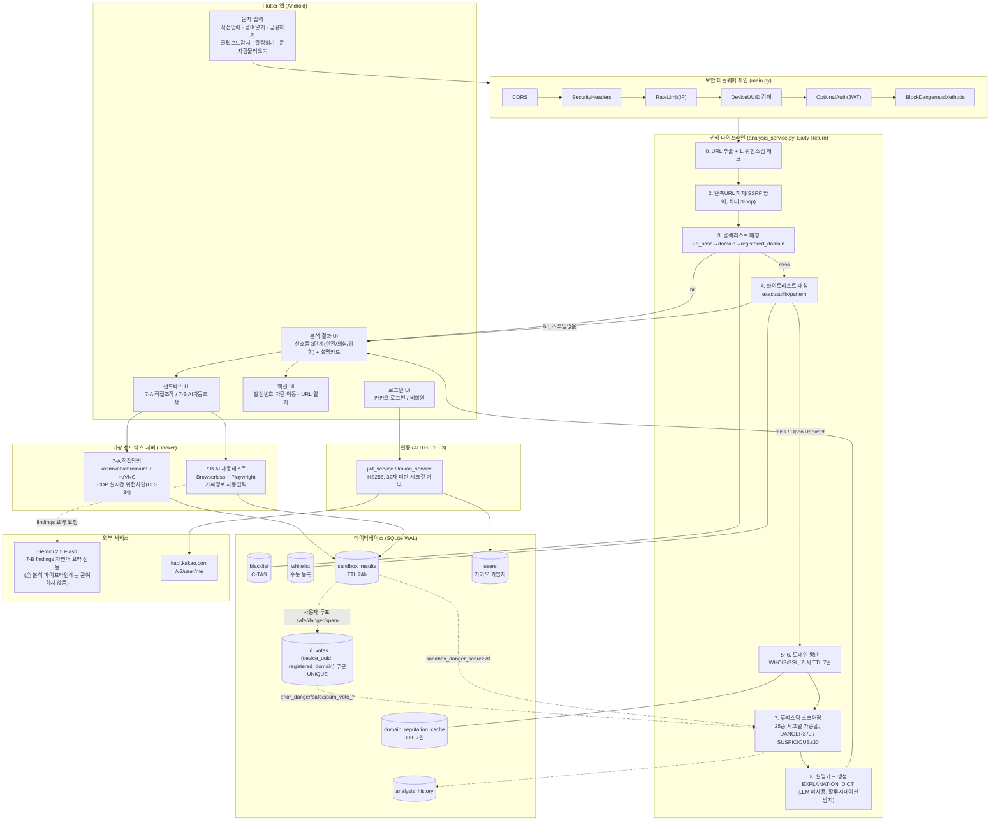

# 시스템 구성도 (2026-07-02 기준, 최종보고서 채택본)

> 위 다이어그램이 최종보고서(`FINAL_REPORT.md`/`.docx`) 4.1절에 실제로 채택된
> 버전이다. UI(파랑) → 서비스 로직(초록) → DB(노랑) 3계층 구조로, 로그인/회원가입,
> 문자 전처리~휴리스틱 스코어링~의심사유 생성까지의 분석 파이프라인, 7-A/7-B
> 샌드박스와 사용자 투표까지 한 화면에 담았다. **"의심사유 생성"은 이 다이어그램에서도
> Gemini가 아니라 서비스 로직 계층(초록)에 위치** — `explanation_service.py`의
> `EXPLANATION_DICT` 딕셔너리 기반이며 LLM을 호출하지 않는다(DC-25). Gemini는
> 이 그림에는 등장하지 않는 7-B 샌드박스 findings 자연어 요약 전용 외부 서비스다.
>
> 아래 Mermaid 소스는 미들웨어 체인·DB 스키마·외부 서비스까지 포함한 더 상세한
> 기술 버전이다(개발자 참고용, 위 채택본과 내용은 동일하되 세분화 수준이 다름).
>
> 이전 `시스템구성도.png`(2026-05-17 작성, `docs/legacy/`로 이동)는 "의심사유 생성"을
> **Gemini 호출**로 표기하고 있었다. DC-25 확정 전 초기 설계도로 현재 코드와 모순돼
> 이 문서로 대체했다.

## 이전 버전과의 핵심 차이

| 항목 | `시스템구성도.png` (legacy) | 현재 |
|---|---|---|
| 의심/위험 사유 생성 | "Gemini 호출 · 설명 전담" | `EXPLANATION_DICT` 딕셔너리 조회 (LLM 미사용, DC-25) |
| Gemini 역할 | 파이프라인 핵심 로직 | 7-B 샌드박스 findings 자연어 요약 전용 |
| 인증 | 없음 | 카카오 로그인 + JWT (AUTH-01~03), `users` 테이블 |
| 휴리스틱 | 없음(암묵적으로 도메인평판만 표기) | 25종 시그널 가중합, DANGER_THRESHOLD=70 |
| 투표 피드백 순환 | 없음 | `url_votes` → `prior_*_vote_*` 시그널 → 다음 분석 반영 |
| 보안 미들웨어 | 없음 | CORS→SecurityHeaders→RateLimit→DeviceUUID→OptionalAuth→BlockDangerousMethods |
