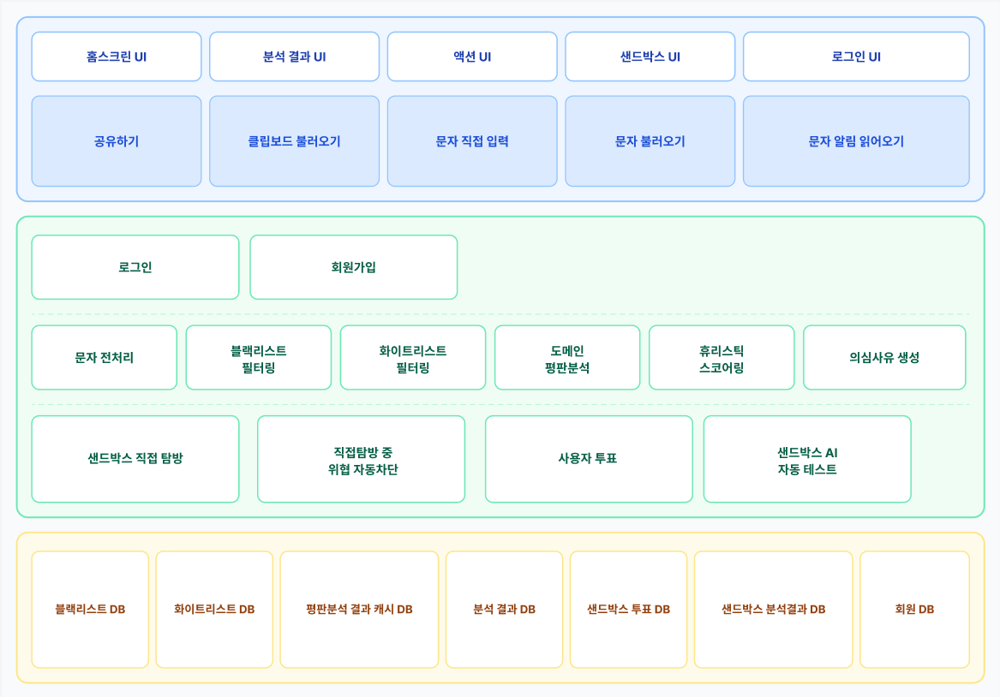

# 시스템 구성도

UI(파랑) → 서비스 로직(초록) → DB(노랑) 3단 구조입니다.

문자를 입력하면 로그인/회원가입을 거쳐 전처리 → 블랙리스트/화이트리스트 필터링 → 도메인 평판분석 → 휴리스틱 스코어링 → 의심사유 생성 순서로 분석이 진행되고, 결과가 애매하면 샌드박스(직접 탐방 또는 AI 자동 테스트)로 넘어갑니다. 여기서 사용자가 남긴 투표가 다시 DB에 쌓여서 다음 분석에 반영되는 구조입니다.

"의심사유 생성"은 Gemini 같은 LLM이 아니라 서비스 로직 안에서 미리 정해둔 설명 문구를 골라 보여주는 방식입니다. Gemini는 이 그림에는 등장하지 않고, 7-B AI 자동 테스트 결과를 사람이 읽기 편한 문장으로 요약해주는 역할만 합니다.
