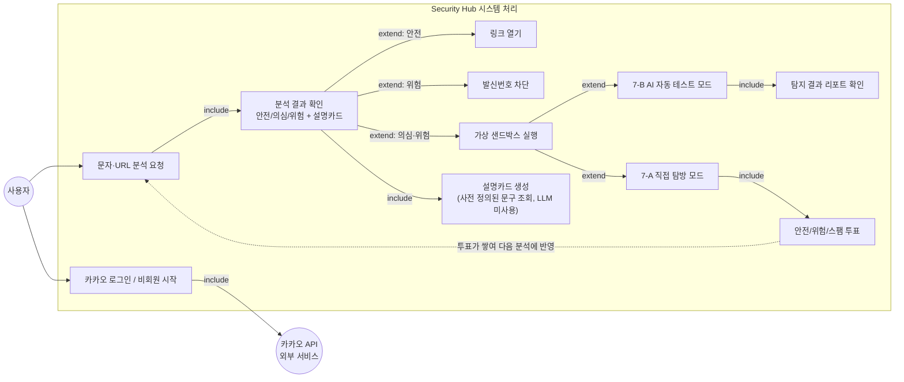

# 유즈케이스 다이어그램

```mermaid
flowchart LR
    User(("사용자"))
    Kakao(("카카오 API\n외부 서비스"))

    subgraph System["Security Hub 시스템 처리"]
        UC0["카카오 로그인 / 비회원 시작"]
        UC1["문자·URL 분석 요청"]
        UC2["분석 결과 확인\n안전/의심/위험 + 설명카드"]
        UC3["링크 열기"]
        UC4["발신번호 차단"]
        UC5["가상 샌드박스 실행"]
        UC6["7-A 직접 탐방 모드"]
        UC7["7-B AI 자동 테스트 모드"]
        UC8["탐지 결과 리포트 확인"]
        UC9["안전/위험/스팸 투표"]
        UC10["설명카드 생성\n(사전 정의된 문구 조회, LLM 미사용)"]
    end

    User --> UC0 -->|include| Kakao
    User --> UC1 -->|include| UC2
    UC2 -->|extend: 안전| UC3
    UC2 -->|extend: 위험| UC4
    UC2 -->|extend: 의심·위험| UC5
    UC2 -->|include| UC10
    UC5 -->|extend| UC6
    UC5 -->|extend| UC7
    UC7 -->|include| UC8
    UC6 -->|include| UC9
    UC9 -.->|투표가 쌓여 다음 분석에 반영| UC1
```

사용자는 문자나 URL을 분석 요청하고, 결과에 따라 링크를 바로 열거나 발신번호를 차단하거나 가상 샌드박스를 실행합니다. 샌드박스 체험 후 남긴 투표는 다시 분석 파이프라인에 피드백되어 다음 판정에 반영됩니다.
