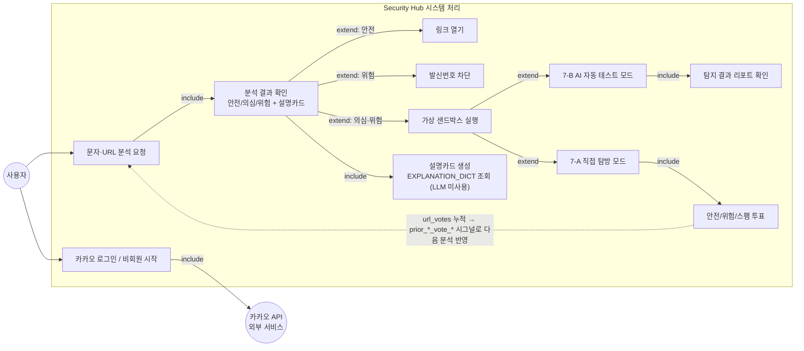

# 유즈케이스 다이어그램 (2026-07-01 기준)

> 이전 `유즈케이스 다이어그램.png`(2026-05-17 작성)는 "의심/위험 사유 생성"을
> **Gemini API가 수행하는 시스템 처리**로 그리고 있었다. `시스템구성도.png`와
> 동일한 이유로 현재 코드(DC-25, `explanation_service.py`)와 모순되어
> `docs/legacy/유즈케이스 다이어그램.png`로 이동했다. 카카오 로그인(AUTH-01~03)과
> 투표(url_votes 피드백 순환) 유즈케이스도 없어서 이번에 추가했다.

## 이전 버전과의 핵심 차이

| 항목 | `유즈케이스 다이어그램.png` (legacy) | 현재 |
|---|---|---|
| 의심/위험 사유 생성 주체 | Gemini API (외부 액터) | 시스템 내부 `EXPLANATION_DICT` 조회 — 외부 LLM 호출 없음 |
| 로그인 | 유즈케이스 없음 | 카카오 로그인/비회원 시작 추가 (AUTH-01~03) |
| 투표 | 유즈케이스 없음 | 안전/위험/스팸 투표 + 분석 파이프라인 피드백 순환 추가 |
